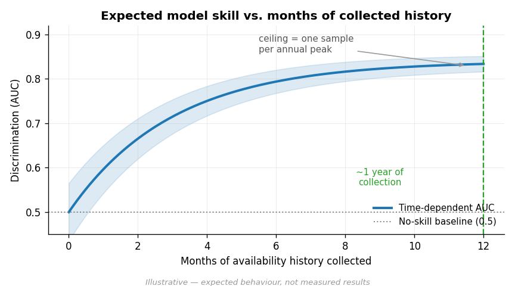
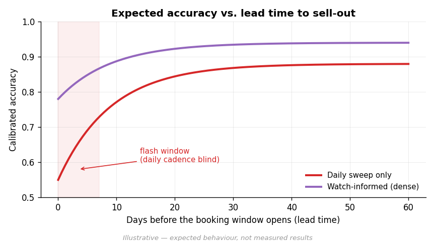

# PREDICT.md — Per-site sell-out prediction

**Status:** Design + **C0–C2 implemented** in `predict/` (builder, KM baseline, hazard model — validated on a synthetic generator with planted ground truth, since real `sites/` history is still ~empty). C3+ and the readiness dashboard (§10) pending real history accumulating (CAMPSITE-PLAN.md §8, shipped).
**Goal:** For a specific site `S` and a specific stay-date `D`, produce a *calibrated probability* that `S` is still bookable on `D` as a function of time — and from it a median sell-out ETA with uncertainty.
**Non-goal:** A deterministic "it sells out at 09:04:12 on Tuesday" timestamp. Cadence and one-sample-per-peak (§2) make that unachievable; we predict a distribution, not an instant.

---

## 1. The problem is time-to-event, not regression

For a target stay-date `D` and site `S`, each collection day yields one observation of `by_date[D]` (`other → available → reserved`). The thing we want to predict — *when does it flip to `reserved`* — is a **survival / time-to-event** problem. The "subject" is a `(site, target_date)` pair; the "event" is the first `available → reserved` transition; observations are **right-censored** when `D` passes still-available, collection ends, or the site is quarantined to `dlq/`.

We model the **hazard**: given the site is still available at observation `t`, the probability it sells out before the next observation.

## 2. Why a year gives less than it sounds — and where the signal actually is

- **Per-cell sparsity.** Each `(site, target_date)` produces *one* burn-down curve per year. July-4-2026 at Bedal site 12 happens once. That cell alone can't yield a distribution.
- **Signal comes from pooling.** A year is thousands of curves (≈60 sites × hundreds of stay-dates) that share structure: day-of-week, holiday, season, site popularity, and **lead time since the booking window opened**. The model learns the *cohort* hazard and conditions down to the cell. This is the central design assumption.
- **One sample per annual peak.** With a single year you get the *shape* of demand by season/DOW/lead-time but only one observation of each specific peak, and no year-over-year trend term.

### Expected accuracy (hypotheses, not results)

These encode the design's expectations so they can be challenged before we build — they are **illustrative, not measured** (generated by `predict/make_figures.py`).



Skill should climb fast in the first months as curves accumulate, then plateau by ~1 year — the cap is the one-sample-per-peak limit, not data volume.



Both approaches predict slow-burn (far-out) sell-outs well; only `watch/` dense sampling holds accuracy inside the flash window near release. This is the §8 cadence limit, quantified — and the argument for expanding `watch/`.

## 3. The clock that makes curves comparable: days-since-release

Do **not** use the calendar as the time axis. rec.gov is a rolling window (Bedal `booking_advance_days: 180`); WA differs. A date reads `other` until release, then the burn-down starts. Define:

```
release_date(D)        = D - booking_advance_days        # from campsites.json
days_since_release(t)  = collection_date(t) - release_date(D)   # hazard clock, t ≥ 0
lead_days(t)           = D - collection_date(t)          # days until the stay
```

`days_since_release` is the survival clock; `lead_days` is a feature. Aligning every curve to `t=0 = window opens` is what makes a summer Saturday at site A comparable to one at site B.

## 4. Unit of observation — the person-period (site-date-period) table

Discrete-time survival ⇒ **one row per `(site, target_date, observation_interval)` while the cell is at-risk** (still `available`). Snapshots are irregular (one site per wake, ≤2-day staleness), so each row carries its interval length as exposure.

```jsonc
// one row of the training table
{
  // ---- keys ----
  "campground_id": "233864",
  "site_id": "81008",
  "target_date": "2026-07-04",
  "obs_date": "2026-06-20",          // collection day of this interval's start
  "interval_days": 2,                // gap to next observation (exposure)

  // ---- survival clock ----
  "days_since_release": 16,          // §3 — hazard clock
  "lead_days": 14,                   // D - obs_date

  // ---- outcome ----
  "event": 1,                        // 1 = flipped available→reserved within this interval; else 0
  "censored": 0                      // 1 = run/stay ended or site→DLQ while still available
}
```

The model joins this skeleton to the feature blocks in §5.

## 5. Feature schema

Grouped by source. All derivable from data we already bank; no new collection.

| Group | Feature | Source | Notes |
|---|---|---|---|
| **Site identity** | `agency`, `kind` | `campsites.json` | rec vs WA hazard shapes differ |
| | `site_type`, `use`, `loop` | `sites/<date>/<id>.json` | WA `type`/`use` may be null (PR #69: `loop` now populated) |
| **Site attributes** | `campground_total_sites` | `campsites.json` | scarcity proxy |
| | `site_popularity` | derived | historical fill-fraction of this site across all past curves |
| | `lat`, `lng` | `campsites.json` | proximity-to-metro / corridor effects |
| **Calendar (of `D`)** | `dow`, `is_weekend` | `target_date` | dominant driver |
| | `is_holiday`, `days_to_nearest_holiday` | calendar table | US + WA holidays; long weekends |
| | `month`, `season`, `is_peak_season` | `target_date` | |
| **Survival clock** | `days_since_release`, `lead_days` | §3 | hazard clock + feature |
| | `release_window_days` | `booking_advance_days` | 180 / WA-specific |
| **State / dynamics** | `cg_fill_fraction[D]` | `sites/` (or `summary/`) | how full the *campground* is on `D` now |
| | `neighbor_fill_fraction[D]` | `sites/` | same loop / same type fill on `D` |
| | `burn_rate_k` | `sites/` history | Δ reserved over last *k* snapshots for this cell's cohort |
| | `days_available_so_far` | `sites/` history | how long this cell has survived since release |
| **Data quality** | `snapshot_staleness` | collection meta | hours since `obs_date`'s actual fetch |
| | `is_watched` | presence in `watch/` | dense vs daily — gates flash-date trust (§8) |

Targets/labels come from the §4 skeleton (`event`, `interval_days`, `censored`).

## 6. Baseline model — discrete-time hazard

**Model:** discrete-time hazard `h(t | x) = P(sell out in interval | survived to t, x)`, fit as **binary classification on the person-period table** — start with gradient-boosted trees (XGBoost/LightGBM); keep penalized logistic as the interpretable reference.

Why this over Cox PH:
- **Irregular, interval-censored** daily/2-day snapshots map cleanly to discrete intervals (include `log(interval_days)` as an offset/feature for exposure).
- **Time-varying covariates** (`cg_fill_fraction`, `burn_rate`) are native to person-period format.
- **Hazard spikes at release** violate Cox proportionality; trees capture the `release × DOW × popularity` interactions Cox can't.
- **Calibration** (the actual deliverable) is straightforward for a probabilistic classifier.

**EDA baseline first:** Kaplan–Meier survival curves by cohort (DOW × season × popularity tier) — both a sanity check (summer Saturdays must burn faster than November weeknights) and the naive benchmark the model must beat.

**Inference — from hazards to answers.** For a `(site, D)` predict the hazard at each future interval, then:
```
S(t) = Π_{u ≤ t} (1 − h(u))                 # survival curve = P(still available)
P(available at horizon L)  = S(L)
median sell-out ETA        = min t : S(t) ≤ 0.5
risk band                  = {t : S(t) ∈ [0.25, 0.75]}   # the uncertainty window
```
Output per cell: a survival curve + median ETA + risk band — *"~85% gone within 3 days of release, median 1 day."*

## 7. Evaluation

- **Discrimination:** time-dependent AUC / concordance (can we rank which cells sell out first at a given lead time?).
- **Calibration:** reliability curve + Brier score on `S(L)` — *the* metric, since the product is a probability.
- **Beats naive:** must outperform the KM cohort-median benchmark (§6).
- **Temporal validity / no leakage:** split by **target-date cohort**, never by row — a cell's *entire* curve lives in one fold, else the burn-down leaks across train/test. With one year, use blocked/prequential CV over target-date windows.
- **Slice reporting:** report metrics split by `is_watched`, agency, season, popularity tier — aggregate numbers hide the flash-date failure mode (§8).

## 8. Known limits (carried from the analysis)

- **Flash sell-outs vs cadence.** Daily/2-day sweep can only localize a flash sell-out to a 48h window — possibly missing a 60-second drain. Reliable flash-date prediction needs `watch/` dense sampling on those cells; `is_watched` gates how much we trust those predictions. Expanding `watch/` coverage is the highest-leverage data improvement.
- **Sell-out is not absorbing.** Cancellations flip `reserved → available`. Baseline models *first* sell-out only; re-release is a §-C5 recurrent-events extension (data already captures it).
- **No exogenous drivers / no year-over-year.** Weather, smoke, events, virality aren't in the data, and one year gives no trend term.
- **New / DLQ'd sites** have no history → fall back to cohort priors.

## 9. Where it lives

The model lives in **`predict/`** in this repo, numpy-only (C0 is pure stdlib), so the whole pipeline is testable offline with no cloud or sklearn dependency. The synthetic generator feeds the *real* C0 builder, so tests exercise the actual code path. When training needs the S3 loader / a real runtime it can move downstream (the `observability` repo owns R2 → InfluxDB → Grafana; see `backend/README.md` boundary). The collector Worker stays out of it.

- `predict/person_period.py` — C0 builder.
- `predict/survival.py` — C1 Kaplan–Meier + cohorts.
- `predict/hazard.py` — C2 discrete-time logistic hazard + survival-curve inference.
- `predict/metrics.py` — AUC / Brier / ECE.
- `predict/evaluate.py` — leakage-safe C1-vs-C2 harness + runnable demo.
- `predict/readiness.py` — the §10 dashboard gauge value.
- `predict/synth.py` — planted-truth generator for validation.
- `predict/make_figures.py` — the illustrative accuracy figures above.

## 10. Predictions dashboard — the readiness gauge

A **separate Grafana dashboard** (distinct from the existing Campsite Availability board), provisioned in `observability/campsites/dashboards/`. Its headline panel is a **readiness gauge** that fills as collection deepens — answering "can we trust predictions yet?" before any number is shown to a user.

**Gauge value** (`predict/readiness.py`, emitted as `campsite_predict_readiness`): the geometric mean of three 0–1 components, so one lagging term holds the gauge down:

```
events   = min(1, observed_sellouts / EVENTS_TARGET)     # enough events to fit
coverage = active_cells / total_cells                    # cells with ≥2 snapshots
depth    = min(1, median_intervals_per_cell / DEPTH_TARGET)
readiness = (events · coverage · depth) ^ (1/3)
```

**Gauge thresholds** map to the bands the model output is gated on:

| Band | Readiness | Meaning | Dashboard behaviour |
|---|---|---|---|
| 🔴 insufficient | `< 0.33` | not enough history | predictions hidden / "collecting…" |
| 🟡 directional | `0.33–0.80` | usable trends, wide bands | show with a "low-confidence" badge |
| 🟢 reliable | `≥ 0.80` | calibrated | show ETAs + risk bands |

Today it reads **0.0 (🔴 insufficient)** on real data and **0.98 (🟢 reliable)** on full synthetic history — the gauge tracks exactly as intended.

**Supporting panels:** events accumulated over time (with the `EVENTS_TARGET` line), coverage & median-depth trends, per-cohort event counts (which cohorts are still data-starved), and C2-vs-C1 AUC/Brier once enough events exist to backtest. Emission piggybacks on the existing R2 → InfluxDB ingest (`observability/campsites/`); no new collector work.

---

## Checkpoints

Each is independently shippable and has an acceptance gate. Don't advance until the gate passes.

| # | Checkpoint | Deliverable | Acceptance gate |
|---|---|---|---|
| **C0** ✅ | **Data assembly** | `predict/person_period.py` walks a local mirror of `sites/<date>/*`, joins `campsites.json` for `booking_advance_days`, emits the §4 table (CSV) + a summary. 9 unit tests cover the interval/event/censoring logic. | **Done.** Builds end-to-end on real R2 data — 14,550 cells across the current 4-day window, 0 events (correct: <2 snapshots/cell so far, no at-risk intervals yet → 9,487 never-available, 5,063 right-censored). Concretely confirms history is the gate. Next-run deltas land here as collection deepens. |
| **C1** ✅ | **EDA + KM baseline** | `predict/survival.py` — KM survival curves by cohort on the `days_since_release` clock + the cohort-marginal benchmark for C2. | **Done** (synthetic): weekend median ETA **5d** vs weekday **21d**, `S(30)` 0.05 vs 0.37 — expected ordering holds. Hand-checked KM in tests. |
| **C2** ✅ | **Baseline hazard model** | `predict/hazard.py` — penalized-logistic discrete-time hazard (GBT a later drop-in) + survival-curve/ETA inference; `predict/evaluate.py` does the leakage-safe (split-by-target-date) C1-vs-C2 comparison. | **Done** (synthetic): beats C1 on all three — AUC **0.72 vs 0.64**, Brier **0.0448 vs 0.0461**, ECE **0.0013 vs 0.0020**. Re-run on real data once readiness (§10) clears 🟡. |
| **D** ⏳ | **Readiness dashboard (§10)** | `predict/readiness.py` (gauge value, done + tested) → emit `campsite_predict_readiness` from the ingest; provision a Grafana board in `observability/campsites/dashboards/`. | Gauge fills as history accrues; flips 🔴→🟡→🟢 at the §10 thresholds. **Gauge value implemented (0.0 real / 0.98 synthetic); Grafana panel + emission pending.** |
| **C3** | **Per-cell predictions** | Batch job writing `predict/<id>.json` (survival curve + median ETA + risk band per `(site, D)`); spot-check a few hot cells against reality. | Outputs produced for all active cells; manual spot-checks plausible (known flash dates show short ETAs, sleepy weeknights long). |
| **C4** | **Watch-informed flash model** | Incorporate `watch/` dense points; report metrics sliced by `is_watched`. | Measurable lift on watched (flash) cells vs daily-only — quantifies the §8 cadence limit and the value of expanding `watch/`. |
| **C5** | **(Stretch) Recurrence + pooling** | Recurrent-events extension for cancellation/re-release; hierarchical partial pooling for sparse/new sites; year-2 trend term once a second year exists. | Re-release predictions calibrated; new-site predictions fall back to cohort priors without blowing up. |

**Critical path:** C0 → C1 → C2 → C3. C1/C2 are code-complete and validated on synthetic data; they re-run on real data once the **readiness gauge (D)** clears 🟡, which is the honest gate on trusting any output. C4/C5 are enhancements; C4 should be prioritized if flash-date accuracy is the product goal, since C2/C3 on daily-only data will underperform exactly where users care most.
