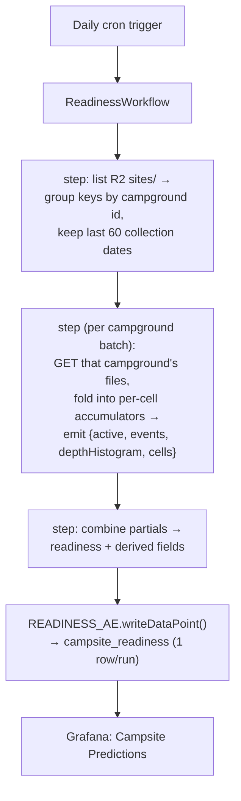

# Readiness Workflow — Plan

Move the **prediction-readiness gauge** off the host (`observability/campsites/ingest.py`
`compute_readiness`) and into a scheduled Cloudflare **Workflow** in this Worker, writing
the `campsite_readiness` Analytics Engine dataset. This is the last piece of the campsite
monitoring → native-Cloudflare migration (`observability-config` `Cloudflare-migration-plan.md`):
demand and availability already write AE; readiness is the only computation that can't ride
the collect path, so it gets its own daily job.

---

## TL;DR

| | |
| --- | --- |
| **What** | A daily Workflow scans ~60 days of R2 `sites/` history, rebuilds per-cell at-risk intervals, computes readiness (geometric mean of events · coverage · depth), and writes one `campsite_readiness` AE row. |
| **Why a Workflow** | Readiness needs **all** sites' history over 60 days at once — it can't be computed in `collectSite()`. A Workflow gives checkpointing + retries for the multi-step R2 scan; daily cron is the right cadence (readiness moves slowly). |
| **Key risk** | Worker memory. A naïve full-history map is ~10⁵–10⁶ cells × up to 60 snapshots — won't fit 128 MB. The design below streams **per campground** with a **depth histogram**, keeping resident memory tiny. |
| **Unblocks** | Repointing the **Campsite Predictions** dashboard to AE, then retiring the host `campsite-ingest` job + `campsites` InfluxDB bucket (migration Phase 6). |

---

## What it computes (port of the existing logic)

The math is fixed by `predict/readiness.py` + `ingest.py:compute_readiness` (which must stay in
lockstep — this Workflow replaces the latter). Constants: `EVENTS_TARGET=500`, `DEPTH_TARGET=6`,
`READY_TARGET_AUC=0.80`, bands `((0.33,"insufficient"),(0.80,"directional"),(1.01,"reliable"))`.

1. **Input:** R2 `sites/<date>/<id>.json`, most-recent **60 collection dates** (`max_days`).
   Each file = one campground's per-site `by_date` snapshot for that collection date.
2. **Cells:** key each `(campground_id, site_id, target_date)` → ordered series of
   `{collected_date: status}` (status ∈ `available | reserved | other`).
3. **Per cell**, walk snapshots in `collected_date` order:
   - an **at-risk interval** = a consecutive pair whose *earlier* status is `available`;
   - the first `available → reserved` flip is a **sell-out event** (stop the cell);
   - `available → other` stops the cell with no event.
4. **Aggregate:** `cells` (total), `active` (intervals > 0), `events` (sold), `median_depth`
   (median of per-active-cell interval counts).
5. **Scores:** `event_score = min(1, events/500)`, `coverage = active/cells`,
   `depth_score = min(1, median_depth/6)`, `readiness = (event_score·coverage·depth_score)^⅓`.
6. **Derived:** `band` from thresholds; `history_months = span_days/30`;
   `expected_accuracy = 0.5 + 0.34·(1 − e^(−months/3))`; `ready_eta_days` = countdown to the
   0.80-AUC boundary, inverting that curve (0 once reached).

The output dict mirrors `build_readiness_line` field-for-field so the dashboard ports 1:1.

---

## Architecture

### Memory-safe scan (the crux)

A flat `(cg,site,tgt) → {date: status}` map over 60 days is ~10⁵–10⁶ cells with up to 60
entries each — too big for a Worker. Instead:

- **Chunk by campground.** R2 keys are `sites/<date>/<id>.json`; group the listing by `<id>`.
  Each campground's 60 files hold ~30 sites × ~180 nights ≈ a few thousand cells — trivially
  resident. Process one campground (or a small batch) per Workflow step → checkpointed + retried.
- **Per-cell accumulator, not history.** Process a campground's dates in order, keeping only
  `{lastStatus, intervals, sold, stopped}` per cell — never the full snapshot list.
- **Depth histogram, not a depths array.** Interval counts are small ints; keep
  `Map<depth,count>` and a running `(cells, active, events)`. Median is exact from the histogram.
  Combining campgrounds = summing scalars + merging histograms. Resident state stays kilobytes.

This makes the job O(GETs) in time and O(distinct depths) in memory.

---

## Schema — `campsite_readiness` AE dataset

One row per run (singleton). Index a constant so latest-wins queries are cheap.

| slot | value |
| --- | --- |
| index | `"readiness"` |
| blob1 | `band` |
| double1..13 | `readiness, event_score, coverage, depth_score, events, active_cells, cells, median_depth, history_months, expected_accuracy, campgrounds, collect_days, ready_eta_days` |

(13 doubles, 1 blob, 1 index — well under AE's 20/20/1 limits.)

---

## Implementation steps

1. **Bindings/triggers** (`wrangler.toml`): add `READINESS_AE` → `campsite_readiness`; add a
   daily cron trigger (e.g. `0 14 * * *` UTC) — or fold into the existing collector cron with a
   daily branch. Register the new Workflow.
2. **`src/readiness.ts`** — pure functions ported from `predict/readiness.py`: `readiness(summary)`
   + the interval/sell-out fold + band/expected-accuracy/eta helpers. No I/O.
3. **`src/readiness-workflow.ts`** — the Workflow: list+group step, per-campground fold steps,
   combine+write step. Uses `env.RAW` (R2) and `env.READINESS_AE`.
4. **Tests** (`*.test.ts`, vitest):
   - **Golden parity** — pin TS `readiness()` output to the Python values for a fixed
     `rows/summary` fixture (same constants, same rounding).
   - **Interval logic** — `available→reserved` counts an event and stops; `available→other`
     stops without; non-`available` earlier status isn't an interval.
   - **Histogram median** — matches the sorted-array median for odd/even/empty.
5. **Deploy + verify** — `wrangler deploy`; force one run; confirm a `campsite_readiness` row via
   the AE SQL API.

---

## Cost & limits

- **R2 reads:** ~60 dates × ~140 campgrounds ≈ **8.4k GETs/run/day** (Class B — cheap). Per-step
  GETs stay well under the **1000 subrequests/invocation** cap by chunking per campground (~60 GETs).
- **AE:** 1 `writeDataPoint`/run — no sampling, no per-invocation pressure.
- **Runtime:** Workflows run long via steps; a daily multi-minute scan is fine.

### v2 optimization (deferred) — incremental

Re-scanning 60 days daily is wasteful. A v2 could persist per-cell accumulators (R2/KV/DO),
fold in only the **newest** collection date each run, and age out day −61 — cutting GETs from
~8.4k to ~140/day. More state/complexity; **v1 ships the full scan** for correctness-first
simplicity, with this as the follow-up if cost matters.

---

## Migration / rollout

1. Ship Workflow + binding; deploy; let it run once; verify `campsite_readiness` has a row.
2. Repoint **Campsite Predictions** (`observability-config`) from InfluxDB `predict_readiness`
   → `campsite_readiness` AE (small PR there).
3. Delete `compute_readiness`/`build_readiness_line` from `ingest.py`. With demand **and**
   readiness now on AE, retire the host `campsite-ingest` job + `campsites` bucket — migration
   **Phase 6** is finally unblocked.

---

## Parity & risks

- **Formula parity** is load-bearing — golden tests pin TS to the Python output; watch float
  rounding (`round(…,4)`) and integer fields.
- **Status normalization** — the Workflow must read the same normalized `available/reserved/other`
  the collector wrote (it does; `by_date` is already normalized at collect time).
- **Memory** — the per-campground + histogram design is what keeps this inside 128 MB; a flat
  history map would OOM. Don't regress to it.
- **Date/timezone** — `collected_date` ordering and the `history_months` span use date strings;
  keep them UTC `YYYY-MM-DD` as written.
- **Singleton index** — querying "latest readiness" relies on AE timestamp ordering; the constant
  index keeps it a single series.

## Open questions

- Cron time + whether to reuse the collector cron or a dedicated trigger.
- Full-scan v1 vs incremental v1 — recommend **full-scan v1** (simpler, correctness-first).
- Batch size per Workflow step (campgrounds/step) to balance step count vs per-step subrequests.
