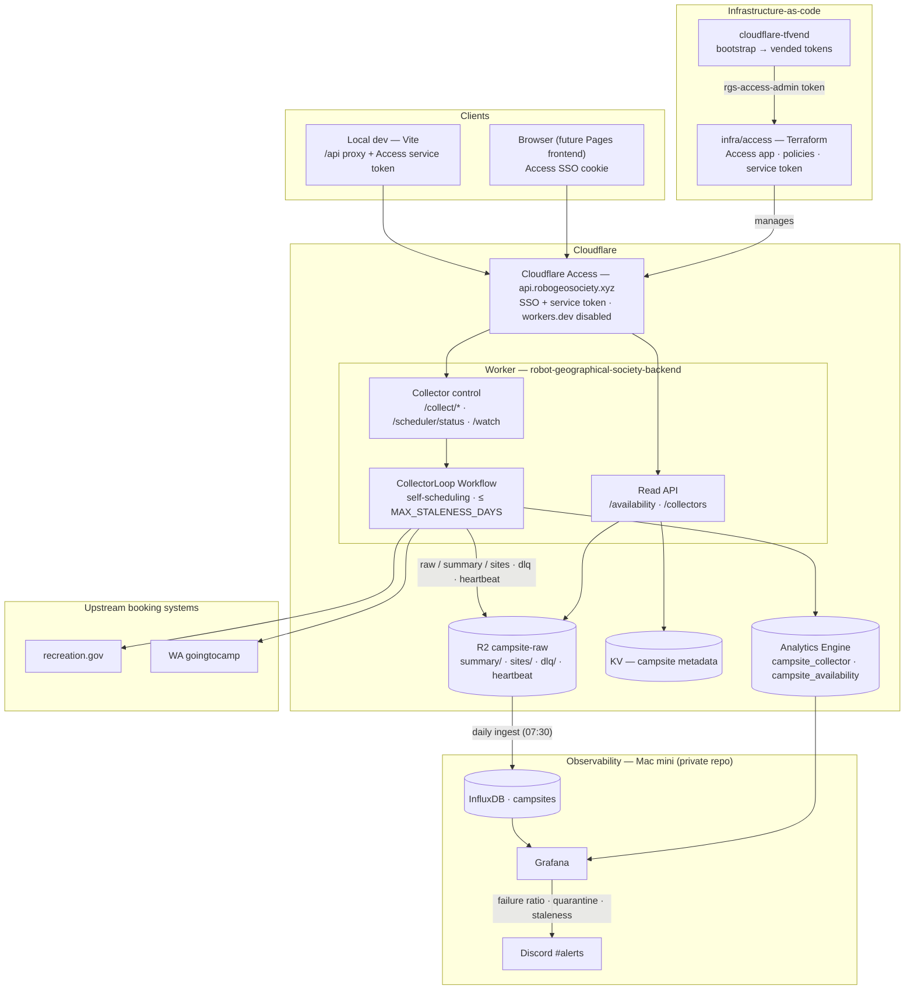
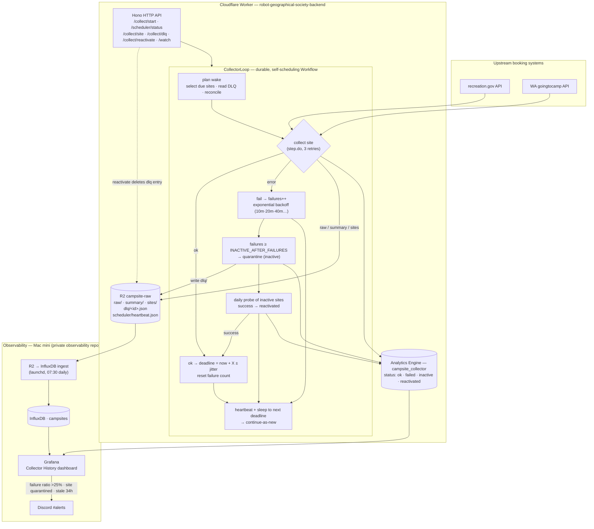

# robot-geographical-society
🤖 A robotic trip planner for human adventure 🤖

The Royal Geographical Society was founded in 1830 to advance geographical science, famously sponsoring monumental expeditions to the Nile, the Amazon, and the Antarctic. Throughout the Victorian era, it served as the primary institution for mapping the "unknown" world and remains a global authority on exploration today via its Wikipedia page.

The Robot Geographical Society performs the same job using computers, foregoing the patriarchal, paper-based excesses of the past.

## Functional Prototype
A **two-view Mapbox app** (React + Vite) over the live Cloudflare collector data, served
through the Access-gated backend. The browser never holds a credential — local dev reaches
the deployed Worker through a same-origin `/api` proxy that attaches the Access service token
server-side (see [Deployment Architecture](#deployment-architecture)).

* **Availability view** (`/availability`) — one pin per collected campground, recolored by the
  available/total ratio for a chosen night (the date picker recolors the whole map). Click a
  campground for its per-site grid, filter by status, and drill into a single site's calendar
  strip across the captured window.
* **Collectors view** (`/collectors`) — fleet health map, one pin per inventory site colored by
  collector state (healthy / overdue / quarantined / disabled), with a fleet-stats panel and a
  quarantine list that reactivates a stalled collector in one click.
* Daily per-site, per-date availability collected by the Cloudflare collector into the
  `campsite-raw` R2 bucket (see [Collector Architecture](#collector-architecture)), surfaced by
  the Worker's read API (`/availability`, `/collectors`).

## Tech Stack

The Robot Geographical Society is built on a modern, serverless stack designed for high performance and low maintenance.

### Frontend
- **[React](https://react.dev/)** (v19): Modern UI library for building the interactive map interface.
- **[Vite](https://vite.dev/)**: Fast frontend build tool and development server.
- **[Mapbox GL JS](https://docs.mapbox.com/mapbox-gl-js/)**: High-performance vector map engine for campsite visualization.
- **[Vanilla CSS](https://developer.mozilla.org/en-US/docs/Web/CSS)**: Custom-designed, lightweight, and modern styling.

### Backend & Infrastructure
- **[Hono](https://hono.dev/)**: Small, fast, web framework built on Web Standards.
- **[Cloudflare Workers](https://developers.cloudflare.com/workers/)**: Serverless execution environment for the backend API.
- **[Cloudflare Workflows](https://developers.cloudflare.com/workflows/)**: Durable execution for the deadline-driven availability collector (`CollectorLoop`).
- **[Cloudflare KV](https://developers.cloudflare.com/kv/)**: Low-latency, key-value data store for campsite metadata and reservation details.
- **[Cloudflare R2](https://developers.cloudflare.com/r2/)**: Object store for collected availability snapshots, the collector heartbeat, and the dead-letter queue.
- **[Workers Analytics Engine](https://developers.cloudflare.com/analytics/analytics-engine/)**: Time-series event sink for per-collection telemetry, queried by Grafana.
- **[Cloudflare Access](https://developers.cloudflare.com/cloudflare-one/applications/)**: The identity-backed auth boundary. The Worker is reachable **only** via the custom domain `api.robogeosociety.xyz` (the `*.workers.dev` route is disabled) — gated by owner SSO and a service token. This is a private project: there is no unauthenticated path.
- **[Terraform](https://www.terraform.io/)**: Infrastructure-as-code for the Access application, policies, and the dev service token (`infra/access/`), authenticated with a token vended from a dedicated [`cloudflare-tfvend`](https://github.com/robogeosociety/cloudflare-tfvend) repo (one bootstrap token → all long-lived tokens, declaratively).

### Testing & Quality
- **[Playwright](https://playwright.dev/)**: End-to-end and integration testing framework.
- **[Vitest](https://vitest.dev/)**: Vite-native unit testing framework for components and API logic.
- **[ESLint](https://eslint.org/)**: Pluggable JavaScript linting for code quality.

## Deployment Architecture

The backend is a single Cloudflare Worker reachable **only** through a Cloudflare Access boundary on the custom domain `api.robogeosociety.xyz` — the `*.workers.dev` route is disabled, so there is no public, unauthenticated path. Humans authenticate via **SSO**; the local-dev frontend reaches the backend through a Vite `/api` proxy that attaches an Access **service token** server-side, so the token never enters the browser bundle. The same Worker serves the **read API** (`/availability`, `/collectors`) and runs the durable availability **collector**; both read from R2, KV, and Analytics Engine. The Access app, its policies, and the service token are managed as code in [`infra/access/`](./infra/access/) (Terraform), authenticated with a token vended from the [`cloudflare-tfvend`](https://github.com/robogeosociety/cloudflare-tfvend) repo (one bootstrap token → all long-lived tokens). `wrangler` (OAuth) handles Worker deploys and the custom-domain bind.



The section below zooms into the collector loop itself.

## Collector Architecture

The **availability collector** keeps each tracked campsite's reservation data fresh. It is a single durable Cloudflare Workflow (`CollectorLoop`) that self-schedules around one guarantee: **every campsite is refreshed within `MAX_STALENESS_DAYS` (default 2)** — no fixed cron. Each site carries a freshness deadline; every wake the loop collects only the sites whose deadline has arrived, reschedules them, writes a heartbeat, and sleeps until the next-earliest deadline. State rides in the Workflow payload and is periodically handed to a fresh instance via *continue-as-new* to bound step history; the R2 heartbeat is the recovery snapshot. See [`SCHEDULER-PLAN.md`](./SCHEDULER-PLAN.md).

**Failure handling.** A failed collection backs off **exponentially** (10m → 20m → 40m …) so a transient upstream blip is retried progressively later instead of on a fixed cadence. After `INACTIVE_AFTER_FAILURES` (default 5) consecutive failures a site is **quarantined**: removed from the schedule, written to the **dead-letter queue** (`dlq/<id>.json` in R2), and emitted as an `inactive` state change. A daily **probe** re-tests quarantined sites; one success (or `POST /collect/reactivate?id=`) emits `reactivated` and resumes collection. This keeps a permanently-dead site from dominating the failure rate — the signal a healthy fleet is measured against.



**Storage & telemetry.** Each successful collection writes three R2 objects (`raw/` upstream payload, `summary/` campground aggregate, `sites/` per-individual-site breakdown) and a `campsite_collector` Analytics Engine row. The Mac-side ingest pulls the daily `summary/` snapshots into InfluxDB; Grafana's **Collector History** dashboard reads both InfluxDB (freshness) and the Analytics Engine (run history, failure ratio, quarantine state) and routes three alerts to Discord:

| Alert | Condition | Meaning |
|---|---|---|
| Failure ratio high | failed ÷ attempts > 25% over 6h | a collector-wide problem, not one site |
| Site quarantined | any `inactive` event in 20m | a campground dropped out of collection |
| Collector stale | no snapshot in InfluxDB for 34h | the loop (or the daily ingest) has stalled |

## CI/CD & Testing Strategy

The project employs a robust testing and automation pipeline via GitHub Actions to ensure reliability across the full stack.

### Testing Layers
*   **Unit Tests (Vitest):** Fast, isolated tests for React components (frontend) and Hono API logic (backend).
*   **Integration/E2E Tests (Playwright):** Full-stack verification that runs during the build process. It orchestrates a local Hono backend with a mock KV store and a Vite dev server to verify real-world interactions and API contracts.
*   **Linting (ESLint):** Enforces code quality and idiomatic React/Node.js patterns.

### Automated Pipeline
Every Pull Request and push to `main` triggers the following lifecycle:
1.  **Environment Setup:** Node.js environment initialization and dependency installation for both `web/` and `backend/`.
2.  **Data Synchronization:** Regenerates the campsite GeoJSON index and seeds the local Cloudflare KV store for the backend.
3.  **Verification:** Runs Linting and Unit Tests in parallel.
4.  **Production Build & E2E:** Executes the production build of the React application, which triggers a suite of Playwright integration tests against a live local service stack.

## Local Development Service

For macOS users, a native `launchd` service is provided to manage the local development stack (Hono + Vite) as a "one-shot" service:

```bash
# Start the dev stack (Backend: 8787, Frontend: 5173)
launchctl start com.robot.geographical.society

# Stop the dev stack
launchctl stop com.robot.geographical.society
```
