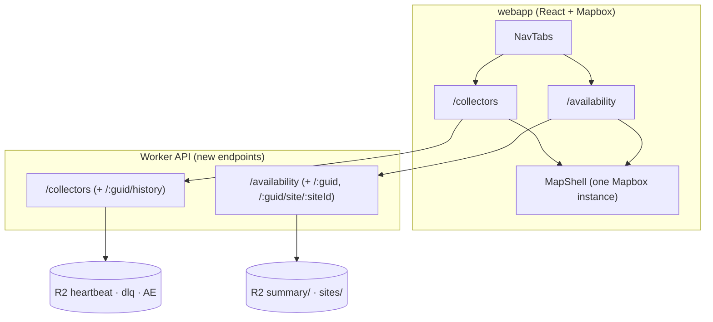

# WEBAPP_PLAN — a frontend for the Cloudflare capture data

> Design proposal. Completes the migration: the old map read a static
> `campsites.json` and a placeholder availability blob. The collector now banks
> real per-site, per-date capture to R2 (`campsite-raw`) and run telemetry to
> Workers Analytics Engine. This plan replaces the single map with a two-view app
> built on that live data.

## Context

What we have after the source-of-truth inversion:

- **Inventory** — `backend/src/campsites-index.json` (156 sites: 140 collected +
  16 `collect:false` map-only/disabled), each with `guid`, `slug`, `lat/lng`,
  `agency`, `collect`, and the provider mapping (`kind` + `ref`/`id`).
- **Capture (R2 `campsite-raw`)** — keyed by **provider id**:
  - `summary/<date>/<id>.json` → `{by_date: {YYYY-MM-DD → {available, reserved, total}}}`
  - `sites/<date>/<id>.json` → `{sites: {siteId → {label, loop, type, use, by_date}}}`,
    `by_date[d] ∈ "available"|"reserved"|"other"`
  - `dlq/<id>.json` → quarantine marker · `scheduler/heartbeat.json` → loop snapshot
- **Telemetry (Analytics Engine `campsite_collector`)** — one row per collection
  (`blobs:[date,agency,kind,name,status]`, `doubles:[n_dates, latency_ms]`, index `id`)
  and per-summary rollups (`doubles:[available, reserved, total, open]`).
- **Heartbeat** — `{lastWakeISO, collectedTotal, sites, inactive, due:{id→deadlineMs}, fails:{id→count}}`.

The current backend (`backend/src/index.ts`) exposes `/scheduler/status`,
`/collect/dlq`, `/collect/*`, `/campsite/:id` (KV) — but **nothing that serves
availability or per-collector health**. This plan adds those endpoints and a new
two-route frontend.

## The two views

### `/collectors` — fleet health map

> "Is every campground being captured, and how healthy is the fleet?"

- **One pin per inventory site**, colored by collector state:
  | State | Meaning | Source |
  |---|---|---|
  | 🟢 healthy | collected within `MAX_STALENESS_DAYS` | last `summary/` date |
  | 🟡 overdue / failing | deadline passed, or `fails ≥ 1` | heartbeat `due`/`fails` |
  | 🔴 quarantined | in the DLQ (inactive) | `dlq/` |
  | ⚫ disabled | `collect: false` (BLM / non-reservable) | inventory |
- **Pin popup** (per collector): status, last-collected date + age, next-due
  countdown, consecutive failures, last latency, # dates captured last run, and a
  7/30-day **run-history sparkline** (ok/failed/inactive) from Analytics Engine.
- **Side panel — fleet stats**: total · active · quarantined · overdue · disabled;
  `collectedTotal`; last-wake age; rolling **failure ratio**; a quarantine list
  with a one-click **Reactivate** (`POST /collect/reactivate`).
- Mirrors the Grafana "Collector History" dashboard, but per-site and on the map.

### `/availability` — availability map

> "What's open, where, on a given night — down to a specific site?"

- **One pin per campsite**, colored by the **aggregate availability ratio**
  (`available / total`) for the selected date — green (lots open) → red (full);
  hollow/grey when not captured (stale or `collect:false`).
- **Filters** (the core of this view):
  - **Date** — a date picker over the captured window (~6 months forward); the
    whole map recolors to that night's `summary`.
  - **Campsite** — search/select to focus a campground (fly-to + open its panel).
  - **Individual site number** — within a selected campground, pick a `siteId`
    (e.g. loop + site) to see **that site's calendar strip**: which dates are
    available / reserved / other across the window (from `sites/`).
- **Pin popup**: `available / reserved / total` for the date, `collected_date`
  (staleness), and a "view sites" action opening the per-site panel.
- **Per-campground panel**: the site grid for the date (label · loop · type ·
  status), filterable by status; selecting a site swaps in its calendar strip.

Shared chrome across both: the same Mapbox base map + WA bounds, agency
legend/filter, a top nav toggling the two routes, and a staleness banner ("data
as of <collected_date>; up to ~2 days behind").

## Backend API additions

All read-only, served by the existing Worker (it already binds `RAW` (R2), `CAMPSITES`
(KV), and the Analytics Engine). The webapp keys everything on **`guid`**; the Worker
resolves `guid → provider id` (via the inventory) for R2 reads, so the browser never
deals with provider-id quirks.

| Endpoint | Returns | Reads |
|---|---|---|
| `GET /collectors` | `[{guid,name,agency,lat,lng,collect,state,lastCollectedDate,ageDays,dueMs,fails,lastLatencyMs}]` | inventory + heartbeat + `dlq/` |
| `GET /collectors/:guid/history?days=30` | run history `[{date,status,n_dates,latency_ms}]` | observability InfluxDB (`localhost:8086`) |
| `GET /availability?date=YYYY-MM-DD` | `[{guid, available, reserved, total, collected_date}]` (all campgrounds for that night) | `summary/` rollup |
| `GET /availability/:guid?date=` | `{sites:[{siteId,label,loop,type,status}]}` for the date | `sites/<date>/<id>` |
| `GET /availability/:guid/site/:siteId` | `{by_date:{date→status}}` — one site's calendar | latest `sites/<id>` |

**Performance — the `/availability?date=` fan-out.** Reading 140 `summary/`
objects per request is too slow/expensive for an interactive map. Proposal: the
collector (or a tiny scheduled aggregator) writes a **per-date rollup**
`summary/<date>/_index.json` = `{id → {available,reserved,total}}` once per
collection day; `/availability?date=` then serves one object. Until that exists,
the prototype fans out behind the Workers **Cache API** (cache key = date, TTL to
next collection). `/collectors` is cheap (one heartbeat + one DLQ list).

## Frontend architecture

Keep the stack (React 19 · Vite · Mapbox GL JS); add routing + data caching.

- **Router** — `react-router-dom`: `/` → redirect to `/availability`; `/collectors`;
  `/availability`. A persistent `<MapShell>` holds the Mapbox instance so switching
  routes swaps layers/handlers, not the whole map (no re-init flicker).
- **Data** — `@tanstack/react-query` for fetching/caching the endpoints (date-keyed
  availability, polled collector health). `VITE_BACKEND_URL` already exists.
- **Layers** — one GeoJSON source (the inventory, fetched once); each route sets the
  circle paint expression (`collected`/state for collectors; availability ratio for
  availability) and the popup renderer.
- **Components** — `MapShell`, `CollectorsView` (+ `FleetStatsPanel`, `QuarantineList`),
  `AvailabilityView` (+ `DateFilter`, `CampsitePicker`, `SitePicker`, `SiteCalendar`),
  shared `AgencyLegend` / `StalenessBanner` / `NavTabs`.
- **Id model** — pins carry `guid` (canonical) + `slug` (for `/campsite/:id` KV
  metadata); availability/health calls use `guid`; the Worker maps to provider id.

## Migration & rollout (checkpoints)

- [ ] **Backend**: `/collectors` + `/availability` endpoints (guid↔provider-id resolver, Cache API).
- [ ] **Aggregator**: write `summary/<date>/_index.json` rollup (collector step or small worker).
- [ ] **Frontend shell**: add router + `MapShell`; move today's map to `/availability` (date = today).
- [ ] **Collectors view**: state coloring, fleet panel, reactivate action, AE history sparkline.
- [ ] **Availability filters**: date recolor, campsite focus, per-site calendar strip.
- [ ] **Cutover**: replace the old single-map `App.jsx`; update e2e + CI; remove the dead `/availability.json` fallback.
- [ ] **(future, gates public deploy)** Gated login — Cloudflare Pages + Access — before anything ships off-box; revisit the InfluxDB-read history endpoint at that point.

Each checkpoint is independently shippable behind the existing standalone/back­end flags.
Everything runs against a **local vitest / wrangler-dev server** until the gated-login
checkpoint lands (see Resolved decisions #4).

## Validated end-to-end test case (a known reservation)

A real booking from the camping vault (`Trips/Middle Fork 2026-06-05.md` — the
"Family of Gerald" calendar stay, **Site 24, Fri night only**) gives a ground-truth
fixture: we *know* this site is reserved that night, and the collector captured it.
**Verified against live R2** (`sites/2026-06-05/234501.json`, collected 2026-06-05):

| Field | Value |
|---|---|
| Campground | Middle Fork (USFS) · guid `0c89950f-d0dc-594e-b48d-b1a5293027aa` · slug `usfs/middle-fork` · rec.gov `234501` |
| Date (night) | `2026-06-05` |
| Site number | **24** → internal `siteId 81835`, loop "AREA MIDDLE FORK CAMPGROUND", type STANDARD NONELECTRIC |
| Captured status | **`reserved`** ✓ |
| Aggregate that night | `available 0 · reserved 23 · total 35` (+12 "other") |

This drives the `/availability` view's three filters end-to-end, with exact assertions:

- `GET /availability?date=2026-06-05` → the `0c89950f…` entry is `{available:0, reserved:23, total:35}`; its pin renders **full** (ratio 0).
- `GET /availability/0c89950f…?date=2026-06-05` → the site list contains `{label:"24", loop:"AREA MIDDLE FORK CAMPGROUND", status:"reserved"}`.
- `GET /availability/0c89950f…/site/81835` → `by_date["2026-06-05"] == "reserved"`.
- **UI walk**: `/availability` → date `2026-06-05` → campsite "Middle Fork" → site number "24" → the calendar strip shows **2026-06-05 reserved**.

> **Contract nuance the test pins down:** the "individual site number" filter is the
> human **`label`** ("24"), not the R2 `siteId` (`81835`) — `/availability/:guid` must
> expose `label`, and the site picker resolves label → siteId. (This is the same
> lookup that motivated the whole migration: "how many sites were reserved at Middle
> Fork" — answer, 23 — now a regression test.)

## Resolved decisions

1. **Aggregator owner → the collector.** The `CollectorLoop` writes
   `summary/<date>/_index.json` at the end of each collection day (one writer, no new
   schedule or auth surface). `/availability?date=` then serves a single R2 object;
   the Cache-API fan-out is the fallback only until the rollup exists.
2. **Run-history source → observability InfluxDB.** `/collectors/:guid/history` reads
   from the InfluxDB at `localhost:8086` (org `home`) rather than the Analytics Engine
   SQL API. This is clean while everything runs locally (the Worker and InfluxDB share
   the host); it's the one endpoint that will need rework if/when the app is deployed
   off-box — see the deploy posture below.
3. **History window → current health first.** `/collectors` v1 colors pins from the
   heartbeat + DLQ + last-`summary` date; the InfluxDB-backed sparkline (decision 2) is
   additive and can land in the same checkpoint or a follow-up.
4. **Deploy posture → local-only for now.** All development and "deploys" run on the
   host: backend endpoints are built and tested against a **local vitest / wrangler-dev
   server**, the frontend points at `localhost`, and nothing is published to Cloudflare.
   Read endpoints are therefore **unauthenticated by deployment** (host-only) rather than
   by policy; `/collect/*` mutations are unchanged. A **gated login (Cloudflare Pages +
   Access)** is the explicit prerequisite before any public deploy — tracked as its own
   future checkpoint, not part of this migration.
