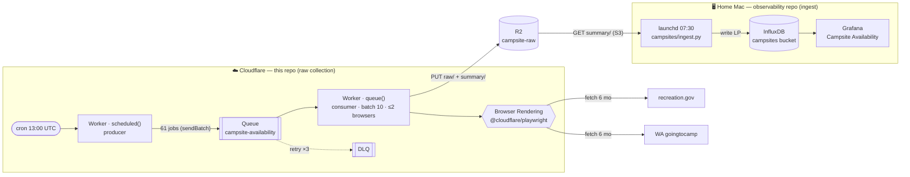
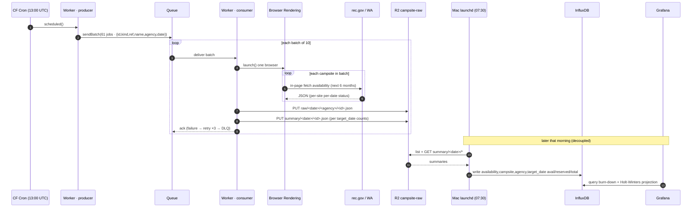

# RGS backend worker

A Cloudflare Worker that serves the campsite API (Hono) **and** runs the daily
**availability collector** — the raw-collection half of the campsite
availability → projection pipeline.

- Live: `https://robot-geographical-society-backend.tommy-b-doerr.workers.dev`
- Cron: `0 13 * * *` (06:00 PT) → enqueues a job per reservable campsite
- Manual trigger: `POST /collect/run` (`?limit=N` to smoke-test N sites)

## Responsibility boundary

This repo owns **raw collection → R2**. The `observability` repo owns
**R2 → InfluxDB → Grafana** (`observability/campsites/`). Nothing here talks to
InfluxDB; the handoff is the `campsite-raw` R2 bucket.

## Infrastructure



| Component | Binding / resource | Role |
|---|---|---|
| `scheduled()` | cron trigger | enqueue one job per campsite |
| `CAMPSITE_QUEUE` | Queue `campsite-availability` | fan-out + retries + DLQ |
| `queue()` | consumer (batch 10, max_concurrency 2) | drain, scrape, write R2 |
| `BROWSER` | Browser Rendering | real Chrome — clears the WAFs |
| `RAW` | R2 `campsite-raw` | `raw/<date>/…` + `summary/<date>/<id>.json` |

## Data flow



**Why this shape:** decoupling collection (cloud cron, reliable, IP-diverse,
runs whether the Mac is awake or not) from ingest (private InfluxDB on the Mac,
pulled from R2 — no inbound exposure). The R2 raw archive is immutable, so the
schema can be reprocessed/backfilled without re-scraping.

## Dev

```sh
npm run dev        # local
npm test           # vitest
npm run typecheck
npx wrangler deploy
npx wrangler tail  # watch the cron/queue live
```

Collector source: `src/collector.ts`. Campsite set: `src/campsites-index.json`
(61 reservable: 39 rec.gov, 22 WA). Ingest side: `observability/campsites/`.
