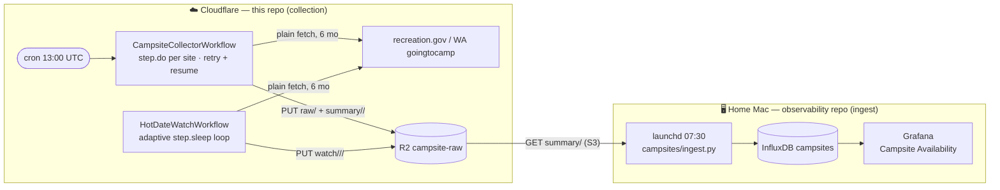
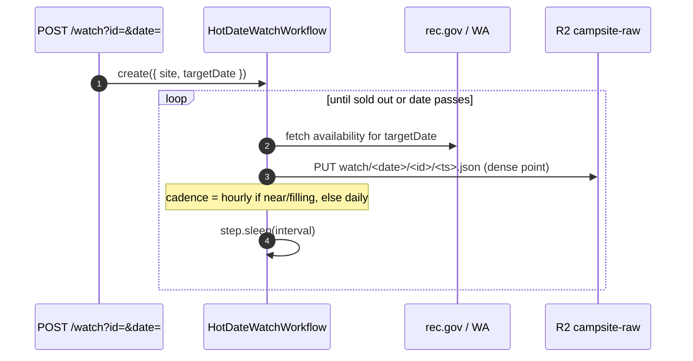

# RGS backend worker

A Cloudflare Worker that serves the campsite API (Hono) **and** runs the
availability collector as **Cloudflare Workflows** (durable execution). The raw
collection half of the campsite availability → projection pipeline.

- Live: `https://robot-geographical-society-backend.tommy-b-doerr.workers.dev`
- Cron: `0 13 * * *` (06:00 PT) → creates a `CampsiteCollectorWorkflow` instance
- On-demand: `POST /collect/run` (`?limit=N`), `POST /watch?id=&date=&every=`

Collection uses **plain `fetch()`** (verified to clear both the recreation.gov
and WA goingtocamp WAFs from Worker IPs) — no Browser Rendering, no queue.

## Responsibility boundary

This repo owns **collection → R2**. The `observability` repo owns
**R2 → InfluxDB → Grafana** (`observability/campsites/`). The handoff is the
`campsite-raw` R2 bucket; nothing here talks to InfluxDB.

## Infrastructure



| Component | Resource | Role |
|---|---|---|
| `scheduled()` | cron trigger | create the daily collector workflow |
| `CampsiteCollectorWorkflow` | Workflow `COLLECTOR_WF` | one `step.do` per site (per-step retry/resume) → R2 |
| `HotDateWatchWorkflow` | Workflow `WATCH_WF` | adaptive `step.sleep` watch of one (site, date) → R2 `watch/` |
| `RAW` | R2 `campsite-raw` | `raw/`, `summary/<date>/<id>.json`, `watch/<date>/<id>/<ts>.json` |
| `CAMPSITES` | KV | the campsite API |

## Data flow — daily snapshot


## Data flow — adaptive hot-date watch (the projection edge)



This emits *dense, adaptive* burn-down data for the specific high-demand dates
you care about — what uniform daily snapshots can't — for materially better
sell-out projections. Durable: survives eviction and resumes mid-loop.

## Dev

```sh
npm run dev        # local
npm test           # vitest (cloudflare:workers stubbed in test/stubs)
npm run typecheck
npx wrangler deploy
npx wrangler workflows instances list campsite-collector
npx wrangler workflows instances describe campsite-collector <id>
```

Workflows: `src/workflows.ts`. Plain-fetch clients: `src/availability.ts`.
Campsite set: `src/campsites-index.json` (61 reservable: 39 rec.gov, 22 WA).
Ingest side: `observability/campsites/`.
