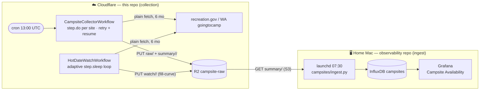
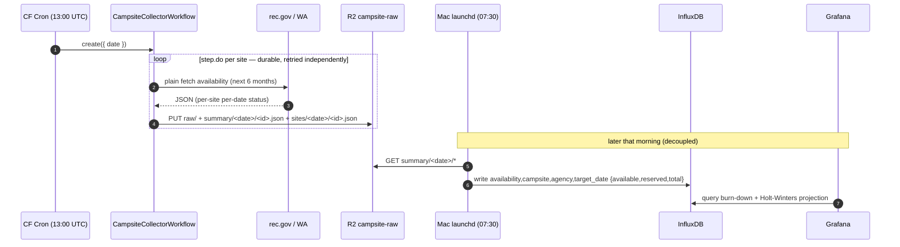
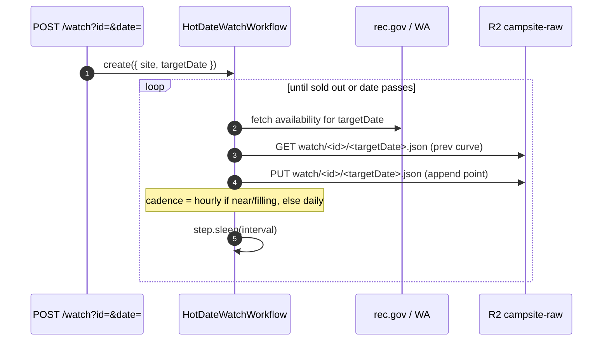

# RGS backend worker

A Cloudflare Worker that serves the campsite API (Hono) **and** runs the
availability collector as **Cloudflare Workflows** (durable execution). The raw
collection half of the campsite availability → projection pipeline.

- Live: `https://robot-geographical-society-backend.tommy-b-doerr.workers.dev`
- Cron: `0 13 * * *` (06:00 PT) → creates a `CampsiteCollectorWorkflow` instance
- On-demand: `POST /collect/run` (`?limit=N`), `POST /watch?id=&date=&every=`

Collection uses **plain `fetch()`** (verified to clear both the recreation.gov
and WA goingtocamp WAFs from Worker IPs) — no Browser Rendering, no queue.

## Responsibility boundary

This repo owns **collection → R2**. The `observability` repo owns
**R2 → InfluxDB → Grafana** (`observability/campsites/`). The handoff is the
`campsite-raw` R2 bucket; nothing here talks to InfluxDB.

## Infrastructure



| Component | Resource | Role |
|---|---|---|
| `scheduled()` | cron trigger | create the daily collector workflow |
| `CampsiteCollectorWorkflow` | Workflow `COLLECTOR_WF` | one `step.do` per site (per-step retry/resume) → R2 |
| `HotDateWatchWorkflow` | Workflow `WATCH_WF` | adaptive `step.sleep` watch of one (site, date) → R2 `watch/` |
| `RAW` | R2 `campsite-raw` | `raw/`, `summary/<date>/<id>.json`, `sites/<date>/<id>.json`, `watch/<id>/<targetDate>.json`, `dlq/<id>.json` |
| `CAMPSITES` | KV | the campsite API |

## R2 object layout

Objects are **keyed by provider id** — rec.gov campground id (e.g. `233864`) or WA
goingtocamp resourceLocation id (negative, e.g. `-2147483476`) — **not** the
`usfs/…`/`wa/…` slug from `campsites.json`.

| Prefix | Shape | Notes |
|---|---|---|
| `raw/<date>/<agency>/<id>.json` | untouched upstream payload | audit trail; two un-normalized schemas (rec.gov vs goingtocamp) |
| `summary/<date>/<id>.json` | `{id,name,agency,kind, by_date: {date → {available,reserved,total}}}` | campground rollup; consumed by the Mac ingest |
| `sites/<date>/<id>.json` | `{id,name,agency,kind,collected_date, sites: {siteId → {label,loop,type,use, by_date}}}` | **per individual site**; `by_date[date]` ∈ `available\|reserved\|other` |
| `watch/<id>/<targetDate>.json` | `{id,name,agency,kind,target_date,lat,lng,started_at,updated_at,done,sold_out, points: [{ts,available,reserved,total}]}` | hot-date **fill-curve** (one object per (campground, target night); read-modify-write append). Read by the webapp's `GET /watch` (was the `campsite_watch` Analytics Engine dataset — re-plumbed AE → R2, #107). |
| `dlq/<id>.json` | quarantine marker | presence == site skipped until reactivated |

`summary/` and `sites/` are normalized **identically across both providers** —
read either through one code path keyed on `by_date[date]`. Verified against live
R2 (2026-06); caveats for consumers:

- **Daily granularity** for both sources — one status per night. (Booking velocity = diff successive daily `sites/` snapshots.)
- **WA leaves `type`/`use` null** (rec.gov populates them). WA `loop` is enriched from the maps API (`map.localizedValues[0].title`); `label` from the resources API. Don't assume `type` is present.
- **Window length varies**: seasonal USFS sites end at season close (~Sept); WA runs the full ~6 months forward.
- **`"other"`** = neither bookable nor a confirmed reservation (not-yet-released / not-reservable); observed on rec.gov.

## Data flow — daily snapshot



## Data flow — adaptive hot-date watch (the projection edge)



This emits *dense, adaptive* burn-down data for the specific high-demand dates
you care about — what uniform daily snapshots can't — for materially better
sell-out projections. Durable: survives eviction and resumes mid-loop. The series
is banked as one read-modify-write **fill-curve** object per (campground, target
night) so the webapp reads it back in a single `GET /watch/:guid/:date` — re-plumbed
off the `campsite_watch` Analytics Engine dataset (now droppable; #107, work item 2).

## Dev

```sh
npm run dev        # local
npm test           # vitest (cloudflare:workers stubbed in test/stubs)
npm run typecheck
npx wrangler deploy
npx wrangler workflows instances list campsite-collector
npx wrangler workflows instances describe campsite-collector <id>
```

Workflows: `src/workflows.ts`. Plain-fetch clients: `src/availability.ts`.
Campsite set: `src/campsites-index.json` (61 reservable: 39 rec.gov, 22 WA).
Ingest side: `observability/campsites/`.

## Discord availability alerts

After each successful `collectSite()`, the `CollectorLoop` compares the new
`summary/<date>/<id>.json` against the most recent prior snapshot (R2 lookback ≤7d)
and posts a green Discord embed for any night that went **0 → available** (gains
only — fill-ups are silent). Logic lives in `src/discord.ts`
(`detectChanges` · `buildEmbed` · `notifyAvailabilityChanges`); it is **opt-in and
non-blocking** — a no-op when the secret is unset, and a webhook failure never fails
collection (it runs in its own replay-safe `step.do`, so a retry can't double-post).

Enable it by setting the webhook URL as a Wrangler **secret** (never commit a real
value):

```sh
npx wrangler secret put DISCORD_WEBHOOK_URL    # paste the channel's webhook URL
```
