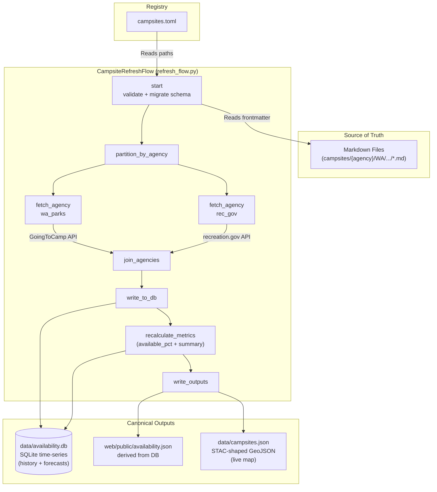

# Campsite Data Pipeline

This directory contains the source of truth for campsite data and the tooling to process it into the two canonical outputs the application consumes.

## 🔄 Data Workflow

A single Metaflow flow (`refresh_flow.py`) replaces the old three-script pipeline. It validates the markdown source, fetches live availability per agency in parallel, derives metrics, and emits the two canonical outputs.



## 🛠️ Commands

All commands run from `data/`.

### Full refresh
Validates markdown, fetches live availability from rec.gov and WA State Parks in parallel branches, recomputes metrics, and writes both canonical outputs.
```bash
uv run refresh run
```

### Validate + GeoJSON only (offline)
Skips the live availability fetch — useful in CI and when iterating on schema changes.
```bash
uv run refresh run --skip-availability
```

### Test on a single campsite
Filter to ids matching a substring (great for debugging a single agency or campsite).
```bash
uv run refresh run --only panorama-point
```

### Tune cross-branch parallelism
Metaflow's `--max-workers` controls how many agency branches run concurrently.
```bash
uv run refresh run --max-workers 2
```

### Crawl recreation.gov for new campgrounds
Interactive helper for adding new campsites to the registry.
```bash
uv run crawl
```

## 🗂️ Outputs

The flow produces exactly two artifacts, joined by stable campsite `id` (`{agency_short}/{slug}`):

| Output | Purpose | Cadence |
|---|---|---|
| `data/campsites.json` | STAC-Item-shaped GeoJSON for the live map (id, datetime, links[], assets{}, summary) | Every refresh |
| `data/availability.db` | SQLite time-series (campground-level today; reserved `site_availability` table for future per-individual-site capture) | Every refresh; grows monotonically |

`web/public/availability.json` is derived from `availability.db` and shipped to the browser.

## 📁 Directory Structure
- `campsites/` — Markdown source of truth (one file per campsite).
- `campsites.toml` — Registry of all active campsites and their file paths.
- `campsite.schema.json` — JSON schema for campsite validation.
- `campsite_sync/` — Python package: clients (`rec_gov.py`, `wa_state_parks.py`), persistence (`db.py`, `migrations.py`, `metrics.py`), feature builder (`registry.py`), quality scoring (`quality.py`).
- `refresh_flow.py` — The Metaflow flow.
- `scripts/` — Standalone CLI tools (`crawl_rec_gov.py`).
- `tests/` — Pytest suite.
