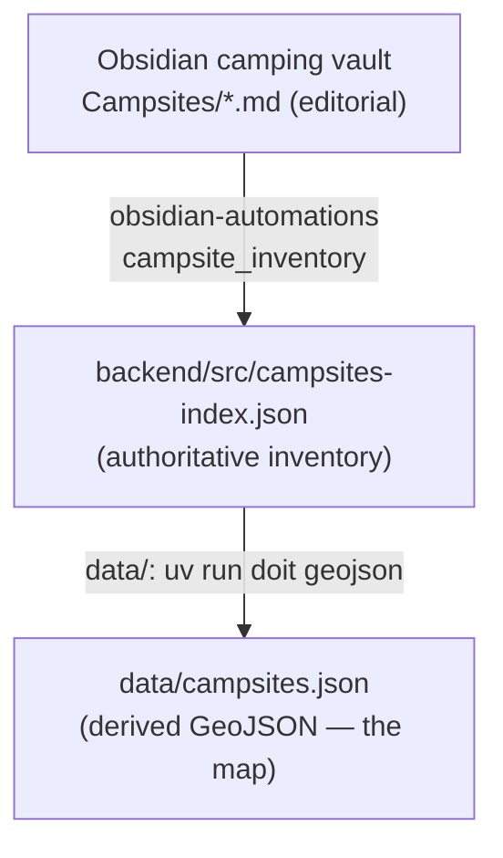

# Campsite Data Pipeline

This directory **derives** the map GeoJSON from the authoritative campsite
inventory. It is no longer the source of truth.

> **Source of truth:** `backend/src/campsites-index.json` — the collector fleet
> plus map-only extras, each carrying a stable cross-agency `guid` and the geo/
> editorial metadata. It is maintained by the **obsidian-automations**
> `campsite_inventory` doit task (camping vault → enriched inventory).
>
> **Availability** (per-site, per-date) is collected by the Cloudflare collector
> (`backend/`) into the `campsite-raw` R2 bucket — not here.

## Flow



## Derive the GeoJSON

Reads `backend/src/campsites-index.json` → writes `data/campsites.json`:

```bash
uv run doit geojson                # from data/
# or, from the repo root:  node scripts/sync-geojson.js
```

Pure projection — no network, no iCloud. Every inventory entry becomes a Feature;
`collect: false` sites (BLM / non-reservable / disabled collectors) still appear
on the map with `properties.collected = false` and are skipped by the collector.

## Discover new campgrounds

`crawl` searches recreation.gov for WA campgrounds not yet in the inventory and
prints ready-to-paste inventory stubs (read-only — it never edits files):

```bash
uv run crawl
# paste chosen stubs into backend/src/campsites-index.json, then:
#   (obsidian-automations)  uv run doit campsite_inventory   # enrich from the vault
#   (data/)                 uv run doit geojson              # re-derive the map
```

## Directory Structure
- `build_geojson.py` / `dodo.py`: the inventory → GeoJSON derivation (`doit geojson`).
- `campsites.json`: derived GeoJSON `FeatureCollection` (never edit by hand).
- `campsite_sync/`: recreation.gov / WA State Parks API clients used by `crawl`.
- `scripts/crawl_rec_gov.py`: discovery tool (`crawl`).
- `tests/`: client + crawl unit tests (live-API tests marked `slow`).
