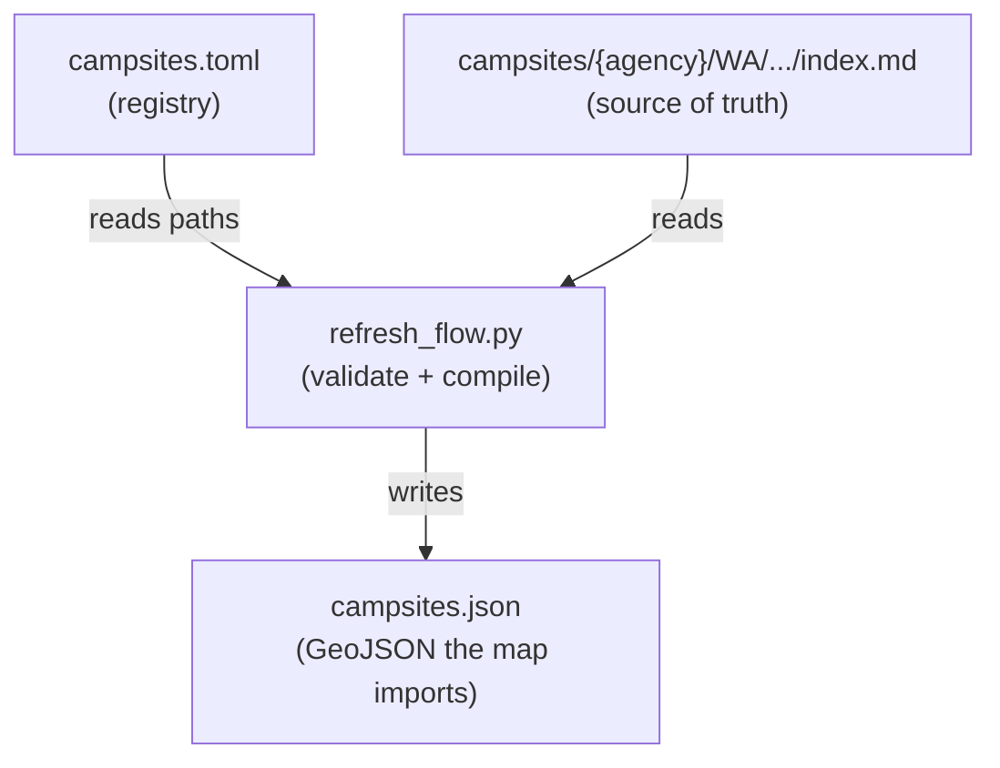

# Campsite Data Pipeline

This directory holds the **source of truth** for campsite metadata and the tooling
that compiles it into the GeoJSON the map consumes.

> **Availability is not synced here.** Per-site, per-date availability is collected
> by the Cloudflare collector (`backend/`) into the `campsite-raw` R2 bucket. This
> pipeline only validates the editorial markdown and writes `campsites.json`.

## 🔄 Data Workflow

`campsites.toml` is the registry of tracked campsites; each entry points at a
markdown file whose YAML frontmatter is the editorial record. `refresh_flow.py`
(Metaflow) validates every referenced file and compiles a single GeoJSON
`FeatureCollection`.



## 🛠️ Generate the GeoJSON

Validates `campsites.toml` + every referenced `index.md` (halts on any error),
then writes `campsites.json`:

```bash
uv run refresh run                 # from data/
# or, from the repo root:  node scripts/sync-geojson.js
```

## 🔎 Discover new campgrounds

`crawl` searches recreation.gov for campgrounds not yet in `campsites.toml`:

```bash
uv run crawl
```

## 📁 Directory Structure
- `campsites/`: individual campsite records (Markdown + YAML frontmatter).
- `campsites.toml`: registry of all active campsites and their file paths.
- `campsites.json`: derived GeoJSON `FeatureCollection` (never edit by hand).
- `campsite.schema.json`: JSON schema for campsite validation.
- `campsite_sync/`: shared Python package (registry parsing, validation, quality
  scoring, and the recreation.gov / WA State Parks API clients used by `crawl`).
- `refresh_flow.py`: Metaflow flow that validates and compiles the GeoJSON.
- `scripts/`: CLI tooling (`crawl_rec_gov.py`).
