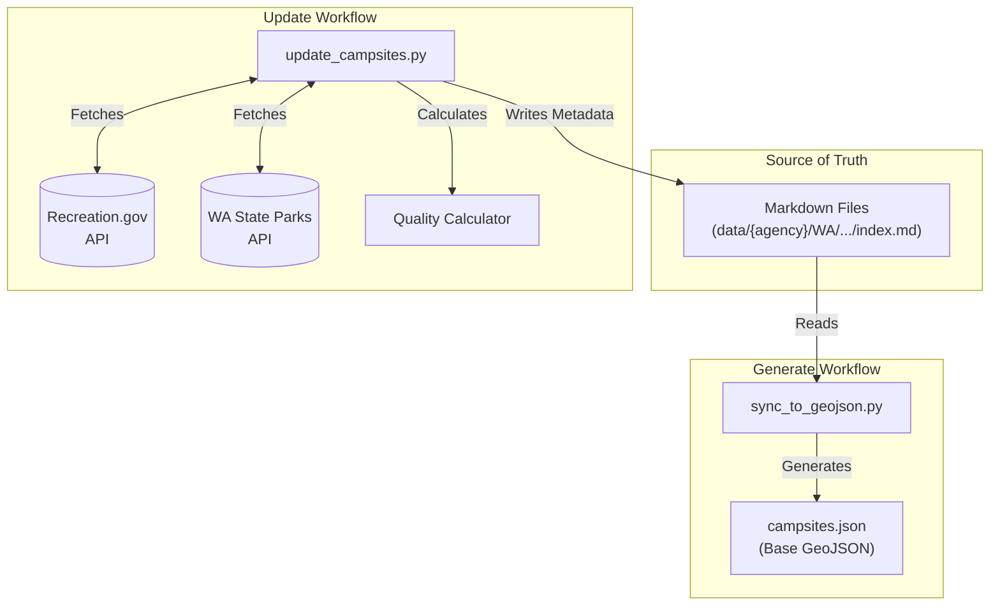

# Campsite Data Pipeline

This directory contains the source of truth for campsite data and the tooling to process it into a consumeable GeoJSON format for the application.

## 🔄 Data Workflow

The data pipeline consists of two main stages: **Update** (enrichment) and **Generate** (compilation).



## 🛠️ Scripts

### 1. Update Campsites
Iterates through all `index.md` files, fetches live availability data from government APIs, calculates quality scores, and updates the Markdown frontmatter.
```bash
uv run update --verbose
```

### 2. Generate GeoJSON
Compiles all `index.md` files (including the embedded availability data) into a single `campsites.json` FeatureCollection. Validates data integrity.
```bash
uv run generate
```
