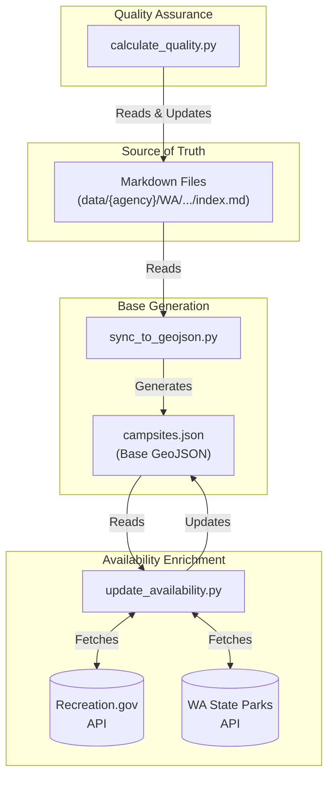

# Campsite Data Pipeline

This directory contains the source of truth for campsite data and the tooling to process it into a consumeable GeoJSON format for the application.

## 🔄 Data Workflow

The data pipeline consists of three main stages: Quality Assurance, Base Generation, and Availability Enrichment.



## 🛠️ Scripts

### 1. Calculate Quality
Scores each campsite (0-100) based on data completeness and updates the `index.md` frontmatter.
```bash
uv run python scripts/calculate_quality.py
```

### 2. Sync to GeoJSON
Compiles all `index.md` files into a single `campsites.json` FeatureCollection. Validates data integrity (coordinates, required fields).
```bash
uv run python scripts/sync_to_geojson.py
```

### 3. Update Availability
Fetches real-time availability data from government APIs for campsites with a `rec_gov_id` or `wa_park_id`.
```bash
uv run python scripts/update_availability.py --verbose
```
