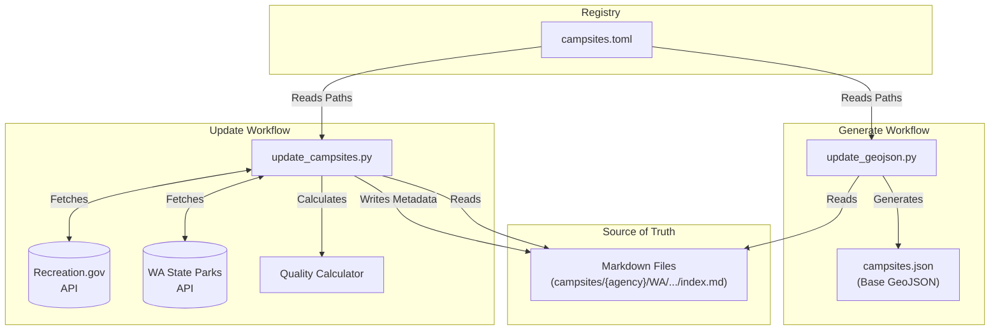

# Campsite Data Pipeline

This directory contains the source of truth for campsite data and the tooling to process it into a consumeable GeoJSON format for the application.

## 🔄 Data Workflow

The data pipeline consists of two main stages: **Update** (enrichment) and **Generate** (compilation). All operations are driven by the `campsites.toml` registry.



## 🛠️ Scripts

### 1. Update Campsites
Reads `campsites.toml`, iterates through the listed campsites, fetches live availability data from government APIs, calculates quality scores, and updates the Markdown frontmatter.
```bash
uv run update --verbose
```

### 2. Generate GeoJSON
Compiles all campsites listed in `campsites.toml` (including the embedded availability data) into a single `campsites.json` FeatureCollection. Validates data integrity.
```bash
uv run generate
```

## 📁 Directory Structure
- `campsites/`: Directory containing individual campsite data (Markdown files).
- `campsites.toml`: Registry of all active campsites and their file paths.
- `campsite.schema.json`: JSON schema for campsite validation.
- `campsite_sync/`: Python package containing shared logic.
- `scripts/`: CLI scripts for the data pipeline.
